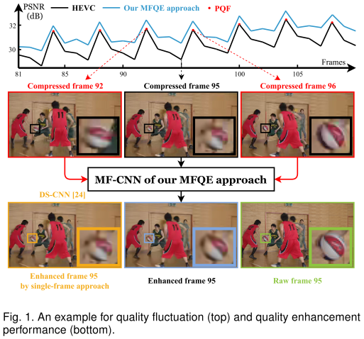
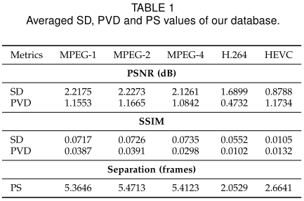
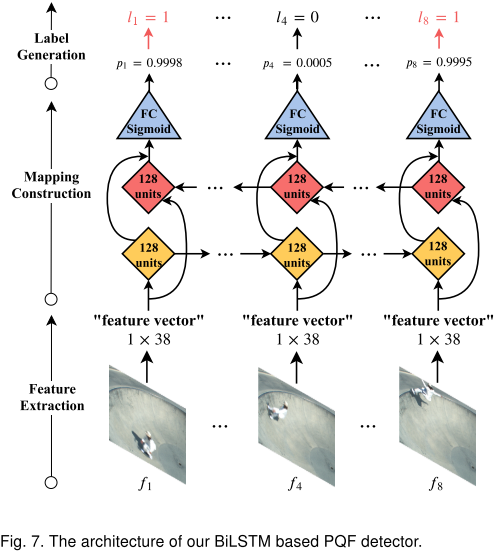
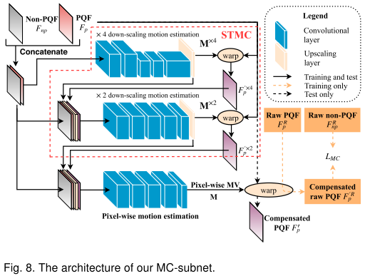
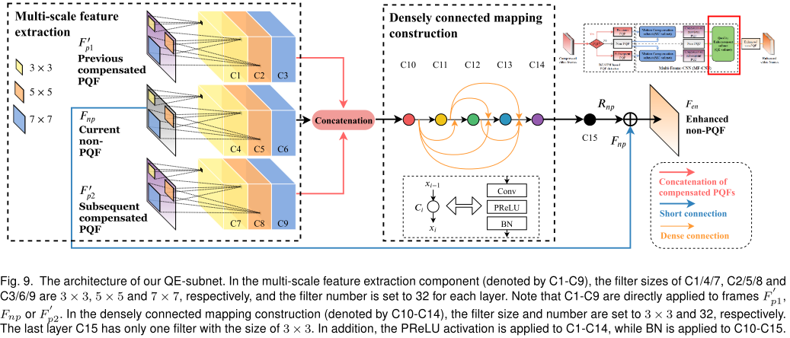
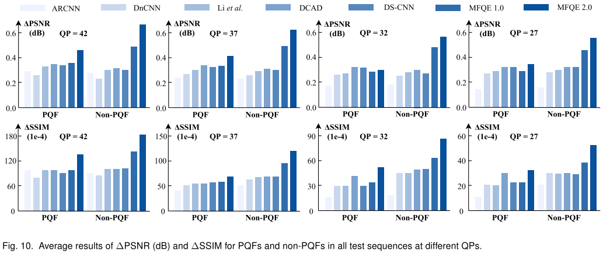
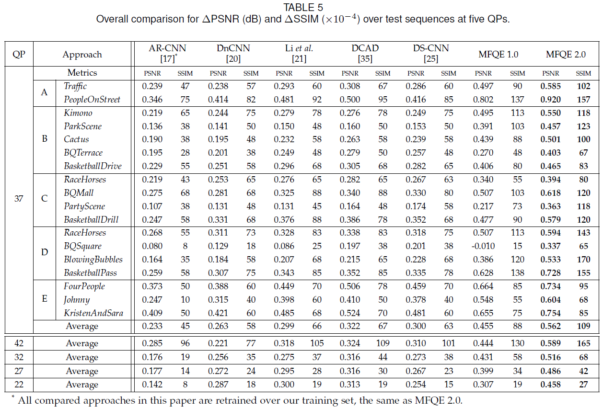
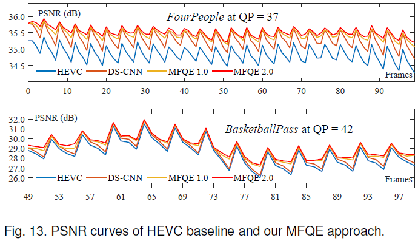
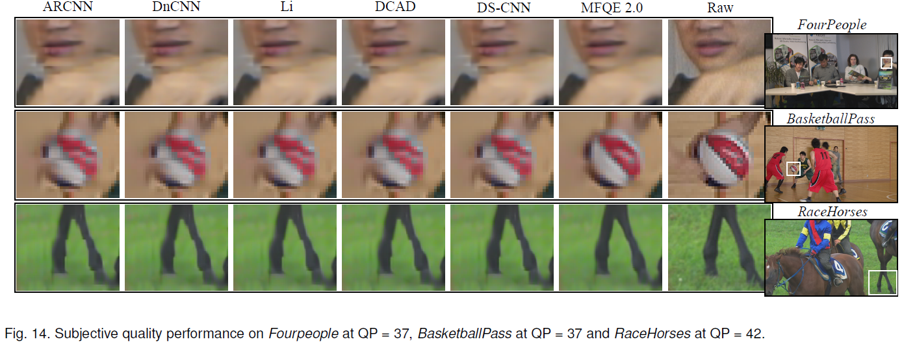

# 论文速览：*MFQE 2.0: A New Approach for Multi-frame Quality Enhancement on Compressed Video*（TPAMI 2019）

- [论文速览：*MFQE 2.0: A New Approach for Multi-frame Quality Enhancement on Compressed Video*（TPAMI 2019）](#论文速览mfqe-20-a-new-approach-for-multi-frame-quality-enhancement-on-compressed-videotpami-2019)
  - [1. 要点](#1-要点)
  - [2. 压缩视频特性分析](#2-压缩视频特性分析)
    - [2.1 质量波动](#21-质量波动)
    - [2.2 帧间相关性](#22-帧间相关性)
  - [3. 方法](#3-方法)
    - [3.1 分类器](#31-分类器)
    - [3.2 好帧运动补偿](#32-好帧运动补偿)
    - [3.3 质量增强网络](#33-质量增强网络)
  - [4. 实验](#4-实验)
    - [4.1 差帧质量提升效果](#41-差帧质量提升效果)
    - [4.2 总体效果](#42-总体效果)
    - [4.3 缓和压缩视频的质量波动](#43-缓和压缩视频的质量波动)
    - [4.4 网络速度](#44-网络速度)
    - [4.5 主观效果](#45-主观效果)
  - [5. 不足和展望](#5-不足和展望)
  - [6. 其他（复现建议）](#6-其他复现建议)

MFQEv2没有使用任何“花哨”的结构设计和训练技巧。我们用最简单的CNN结构实现了我们的思路，网络参数量仅255k。欢迎大家使用。

这篇论文是*Multi-frame quality enhancement for compressed video*（CVPR 2018）的升级版，于2019年9月被TPAMI接收。主要作者还有关振宇副教授，徐迈教授和杨韧师兄。

[[PAPER]](https://arxiv.org/abs/1902.09707) [[CODE]](https://github.com/RyanXingQL/MFQEv2.0)

## 1. 要点

本文提出了一种针对压缩视频的质量增强方法。创新点：

- 现有工作大多忽略了帧间相关性。本文利用了**视频的帧间相关性**。
- 我们应该是第一个考虑了**分层编码的压缩视频特性：质量波动**。
- MFQE应该是第一个**运动补偿+质量增强**的**end-to-end**方法。
- 本文提出的方法，核心思想是**好帧补偿差帧**，是非常具有insight的方法。

我们看图说话：

1. 如图上半部分黑线，压缩视频中存在显著的质量（本文考虑PSNR）波动状况。其中，第92帧和第96帧达到了PSNR局部极大值点，中间的第95帧处在PSNR局部极小值点。
2. 如图下半部分，质量好帧——第92和96帧中的篮球比较清晰，而质量差帧——第95帧中的篮球质量很差（马赛克严重）。
3. 在我们的MFQE算法中，在增强第95帧时，92帧和96帧的信息也会被参考，使得增强效果显著好于图像增强方法DS-CNN（橙色框）。

## 2. 压缩视频特性分析

### 2.1 质量波动

首先，我们以压缩视频库中的6个视频为例，看一看质量波动性：

可见，无论是HEVC、H264还是MPEG-1/2/4，这种质量波动性都是存在的，并且在HEVC中尤为明显。本文以HEVC为主要分析对象。

进一步，我们对这种质量波动性进行量化。我们衡量两个指标：

1. 相邻的好帧和差帧的PSNR差值。差值越大，说明局部质量波动越厉害。这就是所谓的峰值-谷值差值（Peak-Valley Difference, PVD）。
2. 整个视频PSNR的标准差。标准差越大，说明该视频的PSNR越不稳定，即全局质量波动越厉害。这就是文中的SD。

我们在整个视频库（108个视频）中统计了上述两个指标的平均值，结果如表：

质量波动性有两点意义：

1. PVD大，说明好帧、差帧质量差距大，说明**差帧借助好帧提升质量的潜力很大**。
2. SD大，说明好帧补偿差帧的方法非常适用于压缩视频。

### 2.2 帧间相关性

进一步，我们得看看好帧补偿差帧是否可行。我们测量了相邻若干帧的两帧之间的相关系数及其标准差，如图：

结果说明：

1. 时序相关性很强：前后距离10帧内，平均相关系数都能超过0.75。
2. 时序相关性保持较稳定：标准差较小。

那么，压缩视频中好帧（局部质量峰值）之间的平均距离大概是多少呢？我们在上一个表格中展示了PS这个指标，在HEVC大概是2.66。好帧之间的距离如此近，结合上图可知，**两个相邻好帧 与它们中间的差帧 之间的相关性极高**。

总之，我们的思想是有前景的！

## 3. 方法

我们的MFQE方法由一个框图说明：

1. 首先，我们用一个分类器，将视频中的好帧（质量局部极大值）找出来。
2. 对于每一个差帧（只要不是局部极大值，就算差帧），借助其相邻的两个好帧，我们进行质量增强。
3. 在质量增强之前，这两个好帧要进行运动补偿，补偿到差帧所处时刻的状态。
4. 好帧也进行同样的流程，此时好帧借助的是相邻好帧。

批注：MFQEv1.0对于好帧的增强采用的是**图像**增强方法DS-CNN。这里好帧也用相邻好帧进行增强，得到了审稿人好评，因为网络得到了统一和简化。

### 3.1 分类器

分类器用BiLSTM搭建。对于每一帧，我们都采用参考文献[2]提供的质量评估方法，得到一个36维的向量；然后我们再添加这一帧的比特率和QP（这些都可以从码流中轻易获得），得到一个38维的向量，表征这一帧，输入BiLSTM网络。

理想状况下，BiLSTM能够通过比较这些特征向量，找出局部质量极大值点。

要注意，这是一个无参考（no-reference）的分类器：即不需要原始无损视频信息，不需要PSNR信息，而是通过传统的质量评估方法获得的“特征向量”，再进行学习。

批注：MFQEv1.0中的分类器采用的是SVM。这里用BiLSTM，极大提升了分类准确率，并且降低了分类难度，提升了分类速度。

### 3.2 好帧运动补偿

为了让整体网络可以端到端训练，这里的运动补偿网络采用的是基于CNN的光流预测网络[29]。

### 3.3 质量增强网络

运动补偿后的好帧，与差帧一起输入网络。在前端，我们采用了三种scale的特征提取；在后端，我们采用了稠密连接和BN技巧。整体上，我们还采用了短连接。

批注：MFQEv1.0中的质量增强网络是渐进融合网络，效果差得多，参数量也大得多（5倍以上）。

## 4. 实验

### 4.1 差帧质量提升效果

好帧在文中就是PQF，差帧就是non-PQF。如图，MFQEv2.0算法在好帧增强上略高于其他算法，但**在差帧增强方面显著高于其他算法**。这就体现了MFQEv2.0的优势。

### 4.2 总体效果

我们以PSNR的增强数据为标准。如大表格：

在国际标准测试序列（18个视频）上，MFQEv2.0全面胜出，展现出较好的泛化能力。

编码领域通常还衡量BDBR指标。我们看看结果：

图像方法最多能到9%，而MFQE方法能达到14%。

### 4.3 缓和压缩视频的质量波动

由于MFQEv2.0对差帧的提升非常显著，因此可以缓和质量波动现象。我们通过SD和PVD的下降程度来验证这一点：

如图，PSNR的标准差显著下降，而峰值-谷值差距减小，说明质量波动下降明显。此外，我们以两个视频的PSNR曲线举例说明：

显然，MFQEv2.0增强后，PSNR曲线最为平滑。

### 4.4 网络速度

MFQEv2.0不仅效果好，而且参数少、帧速率快。这进一步说明了多帧方法的优势：我们不需要冗余的网络，多帧信息是我们的杀手锏。

如图，其中DS-CNN就是SOTA的单帧方法。

### 4.5 主观效果

## 5. 不足和展望

1. MFQE算法依赖于较为精确的运动补偿（光流预测）。如果运动补偿不准确，那么总体效果可能不理想。现在已经有一些方法跳过了这一步骤，例如使用CONV-LSTM直接输入相邻帧。但是这一点有利有弊：隐式（implicitly）地建模运动（motion），增强性能可能不增反降，因为学习难度增加了。现在还有一些其他的alignment方法，参考本人复现的最新工作[STDF (AAAI 2020)](https://github.com/RyanXingQL/STDF-PyTorch)。
2. 我们只考虑了客观质量PSNR。如果进一步考虑感知质量（perceptual loss）等，主观效果会更好。

## 6. 其他（复现建议）

1. 实验发现，LDP模式下PQF label与QP基本一致。即，QP低的帧可以近似作为PQF（这是由HEVC编码的周期特性决定的）。因此在复现时，为了方便，大家简单地将QP作为PQF label的依据就可以了。根据我们的溶解实验，【预测生成的PQF label】和【真实PSNR生成的PQF label】对应的增强性能基本一致。大家也可以用真实的PSNR作为PQF label的依据。
2. 根据其他老师和同学的反馈，该算法在不finetune的情况下，在VVC等标准的视频上，也能有很高的dpsnr和dssim。
3. 根据实验，简单的【相邻帧补偿】或【差帧补偿好帧】，效果都很不理想。所以【好帧补偿坏帧】是本文MFQE框架成功的关键。
4. 在补偿时要注意：输入的三帧必须在同一场景下。一个视频中可能存在场景切换。可以用SSIM等指标检测切换。
5. 在训练时，第一阶段【运动补偿网络收敛】比较缓慢，可能在前8个epoch的dpsnr都在0dB左右。因为在第一阶段，我们的重点是MC网络，QE网络没有收敛。
6. 更多复现指南及开源视频数据库，请参见[MFQEv2代码仓库](https://github.com/RyanXingQL/MFQEv2.0)。
