# PAPER COLLECTION

- [PAPER COLLECTION](#paper-collection)
  - [Towards Real-World Blind Face Restoration with Generative Facial Prior](#towards-real-world-blind-face-restoration-with-generative-facial-prior)
  - [Review of Postprocessing Techniques for Compression Artifact Removal](#review-of-postprocessing-techniques-for-compression-artifact-removal)
  - [Learning Enriched Features for Real Image Restoration and Enhancement](#learning-enriched-features-for-real-image-restoration-and-enhancement)
  - [:fire: BBN: Bilateral-Branch Network with Cumulative Learning for Long-Tailed Visual Recognition](#fire-bbn-bilateral-branch-network-with-cumulative-learning-for-long-tailed-visual-recognition)
  - [:fire: SRFlow: Learning the Super-Resolution Space with Normalizing Flow](#fire-srflow-learning-the-super-resolution-space-with-normalizing-flow)
  - [Multi-level Wavelet-based Generative Adversarial Network for Perceptual Quality Enhancement of Compressed Video](#multi-level-wavelet-based-generative-adversarial-network-for-perceptual-quality-enhancement-of-compressed-video)
  - [:fire: Photo-Realistic Single Image Super-Resolution Using a Generative Adversarial Network](#fire-photo-realistic-single-image-super-resolution-using-a-generative-adversarial-network)
  - [:fire: ESRGAN: Enhanced Super-Resolution Generative Adversarial Networks](#fire-esrgan-enhanced-super-resolution-generative-adversarial-networks)
  - [:fire: Pixel-Adaptive Convolutional Neural Networks](#fire-pixel-adaptive-convolutional-neural-networks)
  - [:fire: Drop an Octave: Reducing Spatial Redundancy in Convolutional Neural Networks with Octave Convolution](#fire-drop-an-octave-reducing-spatial-redundancy-in-convolutional-neural-networks-with-octave-convolution)
  - [Enhanced Image Decoding via Edge-Preserving Generative Adversarial Networks</b>
](#enhanced-image-decoding-via-edge-preserving-generative-adversarial-networksbsummary)
  - [:fire: Making a ‘Completely Blind’ Image Quality Analyzer](#fire-making-a-completely-blind-image-quality-analyzer)
  - [Learning a No-Reference Quality Metric for Single-Image Super-Resolution](#learning-a-no-reference-quality-metric-for-single-image-super-resolution)
  - [:fire: The Unreasonable Effectiveness of Deep Features as a Perceptual Metric](#fire-the-unreasonable-effectiveness-of-deep-features-as-a-perceptual-metric)
  - [The 2018 PIRM Challenge on Perceptual Image Super-Resolution](#the-2018-pirm-challenge-on-perceptual-image-super-resolution)
  - [The Contextual Loss for Image Transformation with Non-Aligned Data](#the-contextual-loss-for-image-transformation-with-non-aligned-data)
  - [HiFaceGAN: Face Renovation via Collaborative Suppression and Replenishment](#hifacegan-face-renovation-via-collaborative-suppression-and-replenishment)
  - [:fire: Video Multi-method Assessment Fusion](#fire-video-multi-method-assessment-fusion)
  - [:fire: Image-To-Image Translation With Conditional Adversarial Networks](#fire-image-to-image-translation-with-conditional-adversarial-networks)
  - [:fire: High-Resolution Image Synthesis and Semantic Manipulation With Conditional GANs](#fire-high-resolution-image-synthesis-and-semantic-manipulation-with-conditional-gans)
  - [:fire: Semantic Image Synthesis with Spatially-Adaptive Normalization](#fire-semantic-image-synthesis-with-spatially-adaptive-normalization)
  - [Reconstructing the Noise Manifold for Image Denoising](#reconstructing-the-noise-manifold-for-image-denoising)
  - [LIP: Local Importance-based Pooling](#lip-local-importance-based-pooling)
  - [:fire: GANs Trained by a Two Time-Scale Update Rule Converge to a Local Nash Equilibrium](#fire-gans-trained-by-a-two-time-scale-update-rule-converge-to-a-local-nash-equilibrium)
  - [:fire: DeOldify](#fire-deoldify)
  - [:fire: ProxylessNAS: Direct Neural Architecture Search on Target Task and Hardware](#fire-proxylessnas-direct-neural-architecture-search-on-target-task-and-hardware)
  - [:fire: Once-for-All: Train One Network and Specialize it for Efficient Deployment](#fire-once-for-all-train-one-network-and-specialize-it-for-efficient-deployment)
  - [Image Quality Assessment for Perceptual Image Restoration: A New Dataset, Benchmark and Metric](#image-quality-assessment-for-perceptual-image-restoration-a-new-dataset-benchmark-and-metric)
  - [:fire: G-VAE: A Continuously Variable Rate Deep Image Compression Framework](#fire-g-vae-a-continuously-variable-rate-deep-image-compression-framework)
  - [CVEGAN: A Perceptually-inspired GAN for Compressed Video Enhancement](#cvegan-a-perceptually-inspired-gan-for-compressed-video-enhancement)

## Towards Real-World Blind Face Restoration with Generative Facial Prior

1. 设置类似 EDVR 中的 predeblur 模块，先去噪，不要急着加入 facial prior。
2. 采用 spatial transformer，其 guided map 来自前处理模块，目的侧重 fidelity；其 input 是经过预训练 GAN（如 StyleGANv2）处理后的特征 A，目的侧重 realness。
3. spatial transformer 本身也有针对 A 的短路，目的是保持 realness。
4. 对人脸的精细化 loss 处理，例如监督人脸特征（人脸识别网络的中间特征，类似 LPIPS 思想）的一致性，保证是同一个人。

标签：

- 人脸图像增强
- 预训练编码
- 特征仿射变换
- U-Net
- GANs

<b>笔记</b>

方法如图：

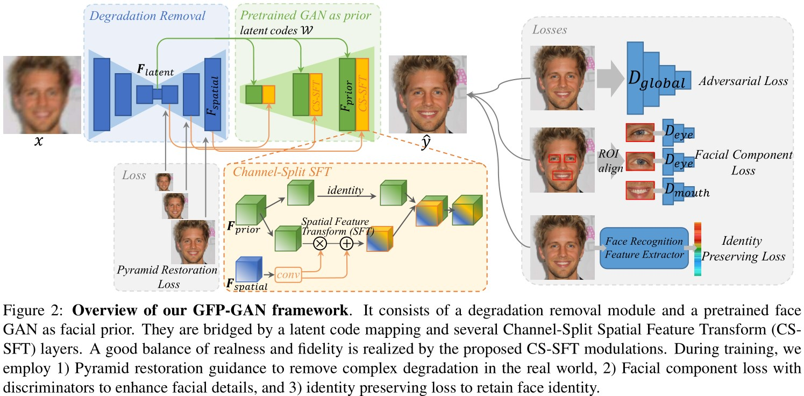

1. 经 U-Net 处理，可以在 decoder 端得到一系列特征图；最小的作者称为 F-latent，依次增大的作者称为 F-sptial。
2. F-sptial 作为仿射变换的 guided map；F-latent 经 pretrained GAN（例如 StyleGANv2）后转换为 latent codes F-prior，再作为仿射变换的 input。
3. 光有仿射变换，可能重建后 fidelity 不足；作者还添加了 F-prior 的短路。这就是所谓的 channel-split。增加短路的目的：如果全由 F-sptial 作为 map 进行仿射变换，会导致 fidelity 较好但 realness 不足（因为 map 是 F-spatial 不是 F-prior）。
4. 利用了 pretrained GAN facial prior：不太依赖 input 或 reference（辛苦在前，轻松在后）。所谓 GAN facial prior，是指 GAN 将任意噪声映射为一张人脸的 prior，这里就是将最小的特征图 F-latent 映射为人脸的特征 F-prior。具体生成 F-prior 的做法见 [77]，可能就是几层网络。
5. 除了全局的对抗 loss，还增加了：（1）reconstruction loss，即 perceptual loss 和 L1 loss 的组合；（2）DFDNet 中类似的 facial component loss：先基于 ROI 选出关键点，然后只监督关键点的 loss；（3）identitiy preserving loss，类似于 perceptual loss，但网络是面部识别网络；以此保证恢复人脸的一致性（是同一个人）。
6. 将降噪和引入 prior 分成了两个子网络：更好处理。

实验：

1. 如果去掉仿射变换，只保留 F-prior，那么输出人脸可能不是一个人。因此 F-spatial 重要；反之，如果去掉 F-prior 的短路，只保留仿射变换，那么 fidelity 更好而 realness 不足；因此，存在短连接的仿射变换（channel-split）相当于提供了一种 trade-off。
2. pyramid restoration loss 和 facial component loss 都很重要；前者在多尺度下进行监督，后者在重要细节上进行监督。

问题：

1. 文章没有细说 pyramid loss 的表达式，只是引用了 [42,62]。
2. pretrained GAN prior 没有细说。
3. F-prior 并不是直接短连接，而是 split 为两部分，一部分短连接，一部分参与 spatial transform。关于这一操作，作者没细说。
4. 绿色框没看明白。经过 prior 得到 3 种分辨率的输出，如何连接，如何得到最终输出？

---

未整理

---

## Review of Postprocessing Techniques for Compression Artifact Removal

大佬在 1998 年写的、关于后处理压缩失真的 review。特别针对基于 block DCT 的压缩算法。还给出了一个简单的增强算法。

关于**率失真优化**：

- 当码率较低时，大多数压缩算法都会产生 annoying 的失真，极大影响压缩图像和视频的感知质量。
- 当码率固定时，具有更多细节的图像，通常在压缩后质量更差。
- 在有损压缩中，码率和失真通常是 tradeoff 的。

关于**处理方法的分类**：

- 为了实现低码率-高感知质量，后处理是一种 attractive 的解决方法。因为后处理可以在 decoding 之后做，方便与现有的标准结合。
- 另一种解决策略称为前处理，即在 encoder end 操作。例如预滤波，将 source 图像中难以察觉的细节滤掉，可以让压缩算法更轻松；或基于 human visual model 的率失真优化。
- 前处理多用于语音处理和编码，而 still image coding 多用后处理。

关于**失真**：

- 失真类型主要由压缩算法决定；例如基于 block DCT 的压缩算法，会在 flat areas 产生块效应，在物体边缘产生 ringing；在基于小波的压缩算法中，ringing 是最显著的 artifact。
- 块效应通常是由分块处理导致的，例如 vector quantization、block truncation coding、fractal-based compression 等。

关于**后处理方法**：

- 后处理的目标是：在给定码率下提高感知质量，或在给定质量要求下提高压缩率。
- 大部分后处理算法都在关注块效应，因为 JPEG、MPEG 等压缩标准都采用了 block DCT。
- 大致分为两个门派：image enhancement 和 image restoration。
- image restoration 的目标是提升 perceived quality subjectively，因此通常会考虑 artifacts 的特殊结构，以及 human visual sensitivities。
- image enhancement 是 heuristic 的，因为没有优化的 objective criterion。
- image restoration 则通常借助 distortion model 的先验知识。例如 CLS，POCS 和 MAP。

本人思考：对于 learning-based 方法，尽管有时以 MSE 为优化目标，但仍然可以属于 enhancement；因为借助了外部先验。

> 以下论文还没来得及 polish。

## Learning Enriched Features for Real Image Restoration and Enhancement

MIRNet：注意力、多尺度的集大成网络。开源完善。声称是图像恢复的SOTA。ECCV 2020

- 图像增强
- 注意力

前人工作大多处理全分辨图像，或处理渐进的低分辨率表示。作者认为前者空域建模准确但语义建模不健壮，后者反之。本文希望在网络中保持高分辨率表示，同时从低分辨率表示中获取较好的语义信息。

大致集成了以下模块：多尺度卷积及其信息交互，空域和通道域注意力建模，基于注意力的多尺度特征融合。

经过如此繁杂的处理，作者认为提取的特征是enriched的。在多个image benchmark上达到了SOTA。

网络整体如图1所示，是一个块堆叠结构。每个块内部有两个多尺度残差块，多尺度残差块内部类似RANet结构，即降分辨率得到低分辨率表示，然后与高分辨率表示之间有交互。

交互具有选择性，如图2所示，本质就是基于注意力融合。

空域和通道域注意力见图3。一般操作。

总的来说就是集大成，设计没啥特别的，但效果好（我怀疑速度很慢）。

## :fire: BBN: Bilateral-Branch Network with Cumulative Learning for Long-Tailed Visual Recognition

BBN：分开训练特征提取和分类器。长尾分类当年SOTA。CVPR 2020

- 图像分类
- 长尾分布

首先作者揭示，广泛用于长尾分布的重采样技术，虽然会增强分类器的学习，但在一定程度上会损害特征学习。

之后是一个有趣的实验。作者先用三种方式训练网络，然后冻结主干网络（所谓的特征提取部分），从零重训分类器，得到如图2结果。本文的motivation就出来了。

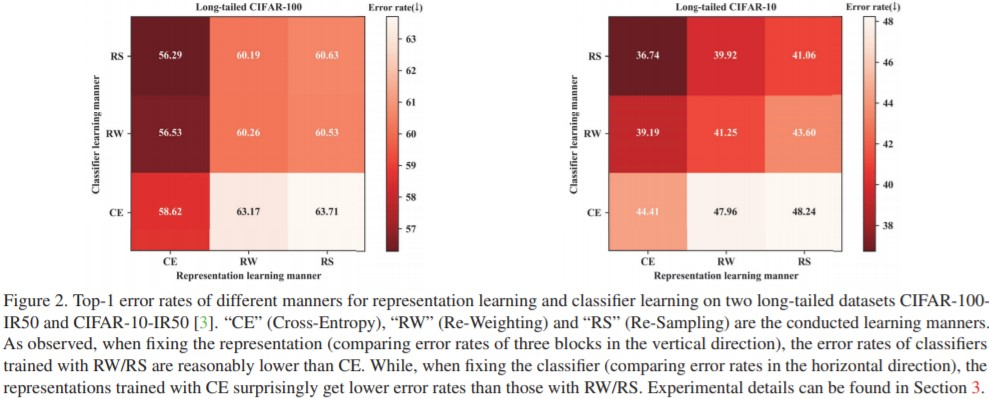

本文就希望同时兼顾二者的训练。

如图3，作者搭建了一个双路网络，称为BBN。在上路，数据是均匀采样的；在下路，数据是重均衡采样的。双路输出的特征通过加权组合，等价于双路的loss加权组合得到最终的loss。作者也将这种策略归为课程学习。

权重$\alpha$是变化的：在初始阶段更重视上路，在后期更重视下路。

具体而言，$\alpha = 1 - \left(\frac{T}{T_{max}}\right)^2$，$T$是epoch数。随着epoch增加，$\alpha$会加速减小。即给初始阶段提供了足够的时间。补充材料图7也说明了这一点，但貌似没有实验。

注意特征提取模块的参数是共享的。

## :fire: SRFlow: Learning the Super-Resolution Space with Normalizing Flow

SRFlow：基于Flow的生成方法。训练稳定，单一损失，变换结果简单，可逆。ECCV 2020

- 图像超分辨
- Flow

SR问题是一个经典的病态问题，有很多可能的解。这一事实很重要，但被现有方法忽略了：现有方法是限定的（deterministic），基于重建loss和对抗loss的组合学习。

本文提出用归一化的flow完成SR，损失函数仅使用负对数似然。该方案更贴近病态问题的本质，也能够生成多样的输出。

最关键的还是灵活改变输出。

作者称，SRFlow的PSNR和perceptual quality metrics都超过了GAN方法，太强了。

具体而言，本文设计了一个conditional normalizing flow结构。所谓conditional，就是提供LR条件下，预测潜在的HR的条件分布。

从第三章开始的方法没有细看了。

## Multi-level Wavelet-based Generative Adversarial Network for Perceptual Quality Enhancement of Compressed Video

MW-GAN：在小波域增强主观质量。ECCV 2020

- 压缩视频增强
- GANs
- 小波域

Motivation（图2）：主观质量与高频分量高度相关。现有增强方法大多都无法提升甚至恶化主观质量。说明方法：观察小波变换后的高频分量的能量大小。

网络设计（图3）：典型的GAN设计，只不过处理对象和训练标签都是图像的小波谱。

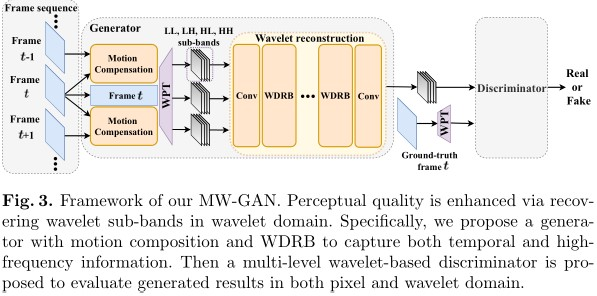

loss由小波域重建loss、运动补偿loss和对抗loss组成。对抗loss是随着epoch增大逐渐参与进来的，运动补偿loss是逐渐退出的，小波域重建loss在不同子带上有不同权重。

小提示（和作者交流）：

- 虽然故事说主观与高频很相关，但权重是一样的，并非重点收敛高频子带或放弃低频子带。
- 在小波域和像素域监督其实没啥区别。在小波域监督也会导致模糊。
- 用RGB训练比在Y上训练效果更明显。
- Multi-level对抗监督的做法被广泛使用，效果不错。
- 对压缩图像而言，保真也是很重要的，因此不能像SR那样随意。

后记：

- 主观效果不明显，原因是去掉了perceptual loss。

## :fire: Photo-Realistic Single Image Super-Resolution Using a Generative Adversarial Network

SRGAN：第一个实现4倍升采样的细节恢复网络。CVPR 2017

- 图像超分辨
- GANs

训练loss由content loss和对抗loss组成。对抗loss会迫使结果更接近自然图像。content loss要求perceptual相似性（VGG中后端特征的相似性），而非像素level的相似性。

结果显示，SRGAN的MOS得分要显著高于传统CNN的结果。

由图2，PSNR和SSIM高的图像，其主观质量并非最高的。

数据集获取：将HR图像高斯模糊，然后降采样。

训练是交替优化鉴别器D和生成器G。鉴别器的优化目标是：

很简单，就是要准确认出真实图像，并且识别出假图像。

生成器是B个结构相同的块组成的。升采样通过sub-pixel（重排）实现。

根据[44]的建议，网络没有使用最大池化，并且使用了$\alpha=0.2$的LeakyReLU。鉴别器网络是8层3x3卷积层，每一层通道数从64到512增加，隔2层翻1倍。当通道数翻倍时，图像长和宽减小1/2（因为是分类器）。

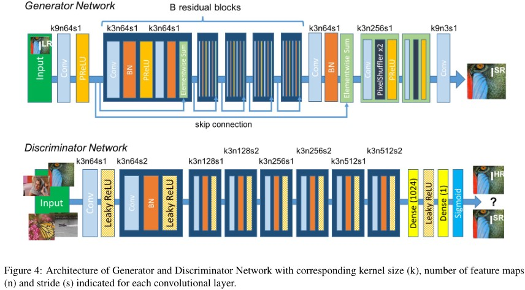

生成器的loss采用组合形式：

其中第一项是VGG loss，即经过预训练的19层VGG网络的第j次卷积后（经ReLU激活）、第i次最大池化前输出的特征图的MSE：

$\phi$就是VGG参数。

第二项对抗loss，刻画生成图像与自然图像的差距，由监督器决定差距大小：

根据[22]，为了使梯度表现更好，该式没有使用$\log{(1 - D)}$。想象一下，如果D输出趋于0，那么loss应该越大越好，因此式6更好。

作者对比了content loss用MSE，VGG22和VGG54的结果，发现VGG54的MOS分表现最好。

## :fire: ESRGAN: Enhanced Super-Resolution Generative Adversarial Networks

ESRGAN：改进SRGAN的细节问题。ECCVW 2018

- 图像超分辨
- GANs

改进：

- 使用Residual-in-Residual Dense Block。
  - 取消了BN操作。
  - RRDB输出经过scaling后传输。
- 参数初始化方差尽可能小。实验证实的。
- 让鉴别器分辨两个图像哪个更真实，而不是判断是否真实。
- VGG loss改为对比激活前的特征。

最后，为了权衡PSNR和感知质量，作者尝试了网络参数插值和图像插值，结果是前者更好。

ESRGAN的整体结构和SRGAN保持一致（图3），但细节被修改。见图4。

当训练数据和测试数据存在差距时，使用BN会导致伪影[26,32]。因此去除。所谓的Residual in Residual，就是大Residual嵌套小Residual。RRDB输出经过放缩后再并入主路，增强稳定性[35,26]。

鉴别器的loss和生成器的对抗loss分别改成了以下形式：

其中RaD是指Relativistic average Discriminator：

内部期望是在mini-batch上计算的。再具体：

最后，作者将VGG loss改为未激活的对比。这是因为特征图稀疏，激活后几乎都是inactive的。

生成器的loss改为三项，即最后加上一个L1重建loss，见式3。

$$
L_G = L_{percep} + \lambda L_G^{Ra} + \eta L_1
$$

为了让PSNR和感知质量权衡，或抑制GAN导致的噪声，我们可以调整L1 loss和对抗loss的权重。但这样做很麻烦。

在训练阶段，我们先用L1 loss训练生成器。然后再用式3的组合loss训练整个GAN。

## :fire: Pixel-Adaptive Convolutional Neural Networks

PAC：给卷积核乘以可学习的、spatially varying的权值。借鉴双边滤波器思想。CVPR 2019

- CNNs
- 注意力

看这篇论文前，可以回忆[[双边滤波器]](https://www.cnblogs.com/wangguchangqing/p/6416401.html)。不同于高斯滤波器（仅考虑位置关系），双边滤波器引入了$\alpha$截尾均值滤波器，考虑像素灰度值之间的差异；然后两个滤波器相乘，就得到了双边滤波器。

作者仿照双边滤波器，提出了PAC。与自注意力方法或全动态方法不同，PAC和双边滤波器一样，仅仅关注局部，因此在一定程度上减小了计算量，实现更简单。

接下来就是讲故事了。

参数共享是CNNs的优势，也是其劣势。为了解决该劣势，作者提出用spatially varying的权值乘以滤波器权值；该varying权值是根据局部像素信息学习得到的。

可以简单证明，PAC是许多滤波器的一般化，即可以特化为众多滤波器，例如双边滤波器、一般卷积和池化等。

直观上看，我们迫使CNNs卷积核共享是不合理的。为了减小loss，CNNs不得不用有限的卷积核来卷积不同内容的特征图。

再进一步，当CNNs训练好以后，卷积核参数就不可变了。本文方法引入了可学习的倍乘参数，因此对于不同的输入图像，可以产生不同的倍乘参数，改变卷积核权值。

现有的卷积核大致可以分为两种：一种是预定义的，例如双边滤波器；另一种是全动态的，很难扩展到整个网络，因为计算复杂度太大了。PAC在二者之间，往下看。

传统卷积是这样的：

i是卷积中心点。可见，卷积核W取值仅仅取决于相对位置差$p_i - p_j$，与内容无关。

为了让卷积核W取值与内容有关，我们把位置进行编码，再对编码信息卷积，即：

但这样做（把特征映射到更高维空间），会导致卷积计算量庞大，卷积向量过于稀疏。

为了解决这一问题，作者采取了另一种方式：作者没有将特征往更高维空间映射后卷积，而是引入spatially varying的核K，让核对高维特征进行简单处理。

例如K可以取高斯核。此时，f就被称为adaptive feature，而K被称为adaptive kernel。f可以自定义，例如将位置信息和色彩信息编码：$f = (x, y, r, g, b)$，也可以是学出来的。

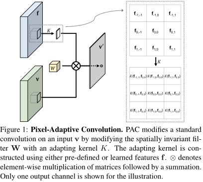

该方法可以特化为见过的卷积核。

- 当W为高斯滤波器时，双边滤波器就出现了。
- 当K恒等于1时，就是一般卷积；即不包含特殊的位置编码信息。
- 当K恒等于1，W恒等于1/(s^2)时，就是平均池化。

## :fire: Drop an Octave: Reducing Spatial Redundancy in Convolutional Neural Networks with Octave Convolution

OctConv：低频卷积的特征图（表示）是可压缩的，进而减小内存需求和计算量。ICCV 2019

- CNNs
- 模型加速
- 频域

在缩小低频通道尺寸的同时，设计了其与完整通道的交互方法。

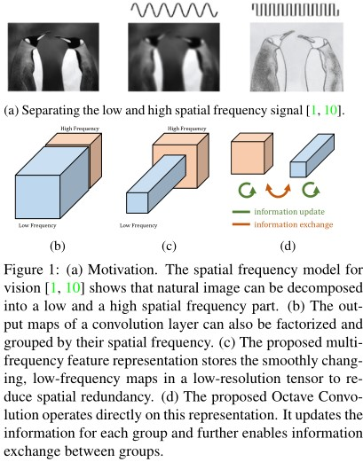

设置一个超参数$0<\alpha<1$，使得$\alpha \%$通道的分辨率是减半的，剩余通道的分辨率不变。这样，计算量和内存需求都降低了。

如何得到这样的特征图呢？在OctConv的输入端，对于划分为低分辨率通道的通道输入，会被高斯模糊后采样，分辨率就变为1/2x1/2了。然后才是OctConv，交互方法也很直观，见图：

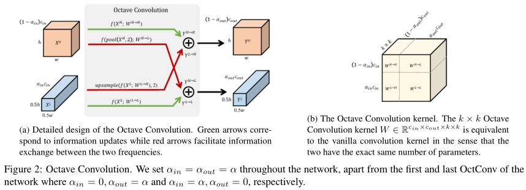

实验中对通道进行傅里叶变换，发现低频通道确实几乎只有低频，而完整通道高低频兼具。

作者称还能提高准确率。这一点或许和感受野扩大有关：缩小的通道上做卷积，相当于空洞卷积。

## Enhanced Image Decoding via Edge-Preserving Generative Adversarial Networks</b>

EP-GAN：用GAN增强解码视频质量。ICME 2018

- 压缩视频增强
- GANs

在一般GAN的基础上加入一个图像边缘预测网络。用Sobel算子生成边缘map，在loss中惩罚生成边缘map与预测map的L2 loss。

预测map会和特征fuse，然后进一步处理。

仅考虑了JPEG；指标为PSNR-B，PSNR和SSIM。

## :fire: Making a ‘Completely Blind’ Image Quality Analyzer

NIQE：通过衡量某些自然图像统计指标，给出图像的无参考质量评分。SPL 2012

- 无参考图像质量评估

之前的NR IQA方法需要失真样本以及对应的人类主观评分。

而本文提出的Natural Image Quality Evaluator（NIQE）只需要自然图像，从中统计一些指标，从而摆脱了对训练数据的依赖。

即，NIQE不基于人类主观意见，也无需知道失真类型，而只考虑输入图像在一些自然指标上的表现情况。这种方法被称为NSS方法，即Natural Scene Statistic。

NIQE首先构建了一套quality aware的feature，然后将它们用multivariate Gaussian拟合。

上述feature可以通过一个NSS模型得到。那么，图像的质量就是两个MVG的距离：前者由自然图像的feature拟合得到，后者由输入图像的feature拟合得到。

首先要按照式1正则化。计算均值和方差都按高斯模板加权。由[10]，对于自然图像，高斯权重是合理的；但对失真图像，权重不一定满足高斯。因此自然图像和失真图像在正则化阶段就拉开了差距。

其次是选patch。作者认为人更关注纹理丰富区域，因此设置了一个方差阈值T。若方差大于T，则该patch被选择。

接下来是用零均值的generalized Gaussian distribution刻画像素x（相当于做一个变换）。该GGD有两个超参数$\alpha$和$\beta$，借助[14]的moment-matching方法可以预测。

对于自然图像，该刻画的空域连续性较强（[3]已证明）；但对有损图像，空域关联性就被破坏了。因此可以考虑水平、垂直方向的刻画的相关系数。

最后，分布的均值也有意义。

这样，4个方向，各4个参数，一共就有16个参数；加上自然图像和有损图像的分布均值，就是18个参数。最后，把图像高斯模糊后做因子为2的降采样，再得到18个参数，一共36个参数。

最后最后，我们用最大似然法，用一个MVG拟合这36个参数。

最终的NIQE，也即图像质量评分，就是两个MVG的距离，如式10。

## Learning a No-Reference Quality Metric for Single-Image Super-Resolution

Ma：早期无参考质量评估方法。CVIU 2016

- 无参考质量评估

简单来说，本文首先建立了MOS库，然后基于此训练网络。本文方法也是评估图像的统计特性，而不是衡量失真。

由于图片较多，因此作者采用绝对评分，而非相对评分（否则就更多了）。

具体而言，本文用3种指标来评估超分辨图像的质量：DCT、DWT和空域PCA，最后用随机森林回归。

实测慢的一批。分数从0到10，越高越好。

## :fire: The Unreasonable Effectiveness of Deep Features as a Perceptual Metric

LPIPS：深度网络普遍会生成类似的感知效果。感知loss可以在其他high-level任务上训练，效果都能远超low-level metrics。CVPR 2018

- 有参考图像质量评估

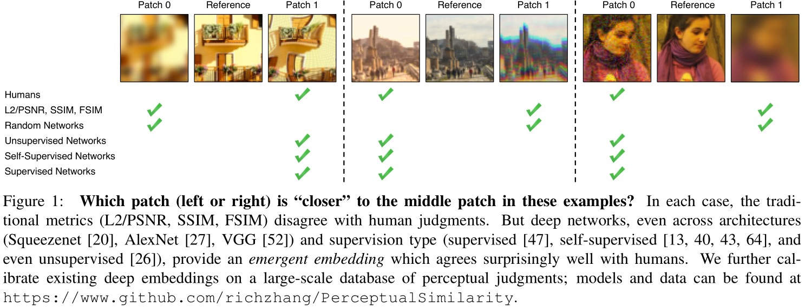

开篇就很有意思：深度网络及特征的比较判断更接近人类。

作者尝试了各种各样的网络，结果都类似。作者结论：深度网络存在普遍性的perceptual similarity。

这篇文章提了我想问的问题：VGG perceptual feature一定要从分类任务中得到吗？实验发现，并不是的！如自监督任务puzzle，也能胜任！甚至一个简单的自监督网络加上K means分类器，也能胜任，而且远比SSIM等好！但训练是必要的，随机初始化网络表现不好。

本文提出了一个BAPPS数据库，其只考虑pair内部谁更像，而非MOS分。

数据库中都是64x64的块。这是因为，当图片较大时，人们可能考虑图像的语义相似性，而非low-level视觉效果。

这种对比建库有一个问题：实验者可能会将同一套标准贯穿整个实验，从而较快完成实验，那么判断就有主观偏见了。因此作者还引入了JND实验，让实验者回答两张图片是否不同。相似的图像最容易混淆。显然，好的指标应该从最容易混淆到最不容易混淆的样本中都采样。结果发现40%回答都是找不出区别。

最后，网络用的是最轻量级的SqueezeNet。3个方案：lin，固定W，仅训练FC；tune：fine-tune所有参数；scratch：全部从头训练。三者在实验中表现差不多。

如图3，LPIPS会把所有layer的输出正则化，乘以权重W，然后取L2。还训练了一个小网络G，根据距离d，判断h（0或1，相似与否）。

## The 2018 PIRM Challenge on Perceptual Image Super-Resolution

PIRM：提出PI指标。ECCVW 2018

- 图像超分辨
- Challenge
- 无参考图像质量评估

PSNR和SSIM等刻画的是distortion，而这些指标与perceptual quality有差异。

并且，[1]认为这种差异无法通过提出更好的distortion指标加以缓解。因为tradeoff是客观存在的。

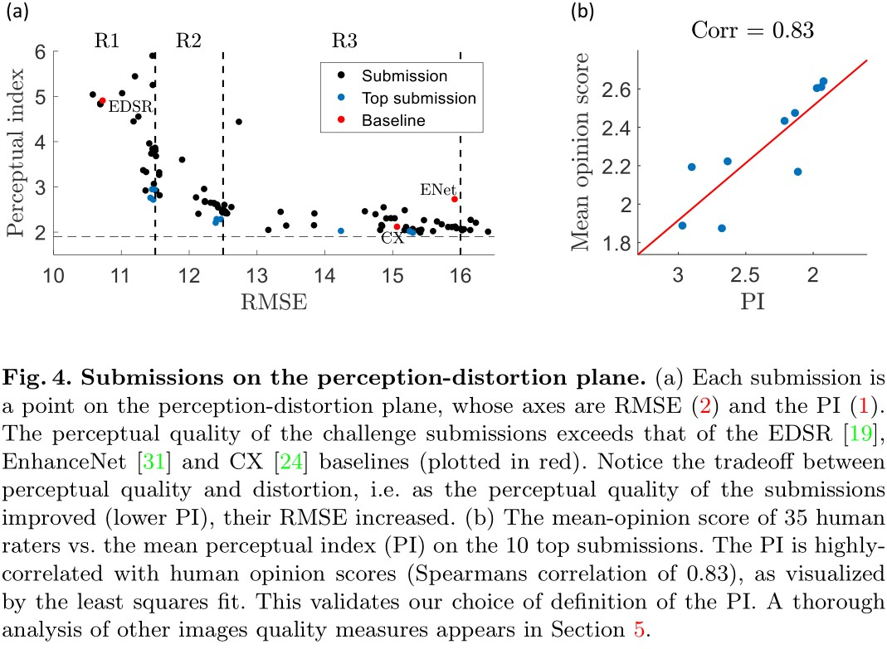

本次PIRM（Perceptual Image Restoration and Manipulation）是第一次提出用坐标系来刻画tradeoff的竞赛。

由于缺乏通用的评价指标，perceptual类的竞赛之前是不存在的。

竞赛数据集是bicubic下采样的。

竞赛指标为RMSE和PI。RMSE是测试集所有图像的MSE取平均后开根号，PI是：

$$
\text{PI} = \frac{1}{2} ((10 - \text{Ma}) + \text{NIQE})
$$

如此构造的PI是无参考的。

作者实验发现PI和主观分数MOS相关系数达到了0.83，挺高。

本文分析挑战结果，也指出：不是所有图像都是公平的（参见图8左），SR图像也有难易之分。

此外作者认为，现有的方法无法同时很好地重建texture和structure。如图8右，石雕强调structure，而大楼的texture更丰富。

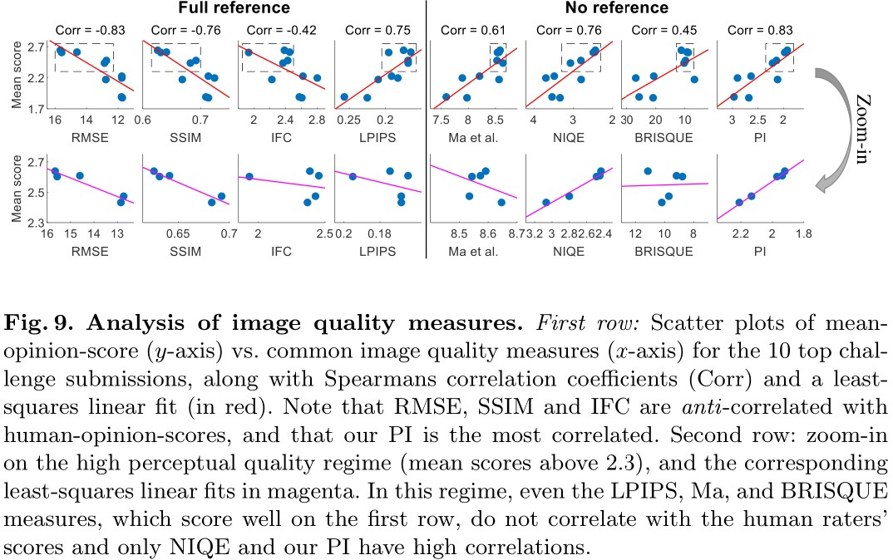

如图，LPIPS在整体上和MOS分正相关，但在高MOS段是负相关。

## The Contextual Loss for Image Transformation with Non-Aligned Data

Contextual loss：风格迁移不存在pair data，如何训练GAN？进一步，如何实现特定区域的风格迁移，例如人脸？ECCV 2018

- 风格迁移
- GANs

通常GANs都依赖于pair data，因为loss需要刻画相似性。而本文提出不需要pair data的loss。

当时的loss分为三类：一类是pixel-to-pixel的，例如L2；另一类是global的，例如Gram loss；还有一类是GAN loss。

Gram loss可以用于unpaired或unaligned的数据，但它作用效果为整张图（我的理解为整张图片都有迁移风格）。有时我们只希望让特定区域被迁移，例如人脸。

本文方法简单粗暴：只监督特征的相似性，不考虑像素域相似性。

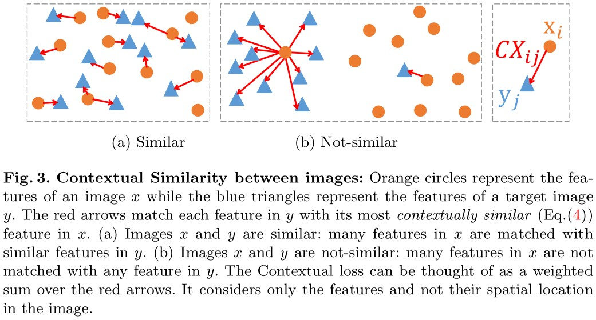

思路很直接，如上图。如果图像X和Y的大量特征都能一一接近，那么X和Y就是相似的；否则就是不相似的。例如在b中，大量x找不到配对y。

显然，最简单的刻画，就是每个y距离其最近x的距离，然后对所有y求和。如果用CX表示相似性，那么距离越近，相似性就越大，所以是max：

$$
\text{CX(X,Y)} = \frac{1}{N} \sum_j {\max_i} \text{CX}_{i,j}
$$

光是这样不行。我们希望这种相似性与整体距离无关，即，迁移风格可以出现在图像任意位置，而并不一定是原本的位置。经过式2和3操作，相似性w一定是在0和1之间；然后再用所有w之和进行归一化，使他们和为1。

相似性越低，loss越大，因此取负对数即可，如式5。

## HiFaceGAN: Face Renovation via Collaborative Suppression and Replenishment

HiFaceGAN：在SPADE基础上，针对恢复问题进行的改进。ACM 2020

- 人脸图像增强
- GANs

本文要解决人脸的盲增强。本文称自己为dual-blind，因为有的方法需要GT（single-blind），还有的方法需要先验（例如landmark和语义分割信息），但HiFaceGAN都不需要。

本文的对比算法中，ESRGAN引入了新的噪声，而其他算法几乎没有帮助。

结构上，G使用了UNet架构，确实能实现multi-stage效果。所谓suppression就是UNet的压缩通路，所谓replenishment就是UNet的解码通路。作者的故事：压制失真，恢复细节。

在细节上，一般卷积的问题是平移不变性。显然，背景和人脸区域最好有不同的处理。因此改进卷积为式2。为了体现对称性，干脆取其为自身内积。内积结果用来加权卷积。如图4。

解码模块使用SPADE。实际上和SPADE使用分割图很不一样，这是作者的故事罢了，并且增加了参数规模和学习能力。

在loss方面，采用了GAN loss，VGG预训练的perceptual loss和多尺度特征匹配loss[53]的组合。没有使用L1/L2 loss。

由于HiFaceGAN不依赖于人脸先验，因此可以用于其他任务。

后记：原SPADE的输入是instance map，而HiFaceGAN输入的是16像素的人脸图。作者认为，该任务类似于纹理字典学习，instance map只能提供10个label，因此针对10种目标学习特定的纹理；而16像素人脸能提供更加细粒度的学习，因此细节恢复效果更好。从溶解实验也能看到，从SPADE到16xFace的增益是巨大的。这也是本文的主要贡献。至于自注意力的conv，只是小贡献。

后记：自注意力是通过LIP方法建模的。不是本文的贡献。

## :fire: Video Multi-method Assessment Fusion

[[VMAF]](https://netflixtechblog.com/toward-a-practical-perceptual-video-quality-metric-653f208b9652)：Netflix商用视频质量评估方法。源于2016，2020仍在维护

- 无参考视频质量评估

- [[Blog1]](https://netflixtechblog.com/toward-a-practical-perceptual-video-quality-metric-653f208b9652)
- [[Blog2]](https://netflixtechblog.com/vmaf-the-journey-continues-44b51ee9ed12)

在工作过程中，作者发现：他们接触的视频的编码格式、分辨率、内容太丰富了，很难用主观评价（Expert viewing）来评价视频质量。而PSNR、SSIM等离人类perceptual太远，这我们都知道。于是作者开始思考VMAF。

有几点要求：smooth video playback，低噪，在有限带宽和受限的设备下主观效果尽可能好。

有相当多的学者已经验证了VMAF的优越性：在4K，gaming等content上，VMAF和perceptual quality最为接近。VMAF甚至被用来决策最优编码策略。

## :fire: Image-To-Image Translation With Conditional Adversarial Networks

pix2pix：提出结合L1 loss和GAN loss，使GAN在保真情况下具有一定创造性。可能是第一篇用GANs做图像转换的。CVPR 2017

- 图像转换
- GANs

conditional GANs是输入随机噪声z，同时输入图像x，通过改变噪声，产生新的输出y。loss是GAN loss。

前人工作发现，加上L2 loss可以更保真。作者在本文中尝试用L1 loss，和L2相比不会过于模糊。

在conditional GANs的基础上，作者尝试去掉z，而直接输入x。结果发现，网络仍然能正常学习x到y的映射，但映射类似delta，是deterministic的，缺乏随机性。

加上z实际上也没有太好的效果，作者发现网络会学会忽略这一噪声z。

作者还尝试了用dropout产生噪声，结果发现随机性很小。这一问题仍然没有解决。

在网络设计上，生成器用的是UNet。这种信息传递结构对上色等任务非常重要。对于鉴别器，本文采用的是PatchGAN，即在patch上计算loss，再取平均，实验发现高频细节恢复效果更好。

## :fire: High-Resolution Image Synthesis and Semantic Manipulation With Conditional GANs

pix2pixHD：生成高分辨率图像。CVPR 2018

- 图像转换
- GANs
- 语义分割信息

以往的方法无法很好地生成高分辨图像。为了实现这个目标，作者提出了几点方法：

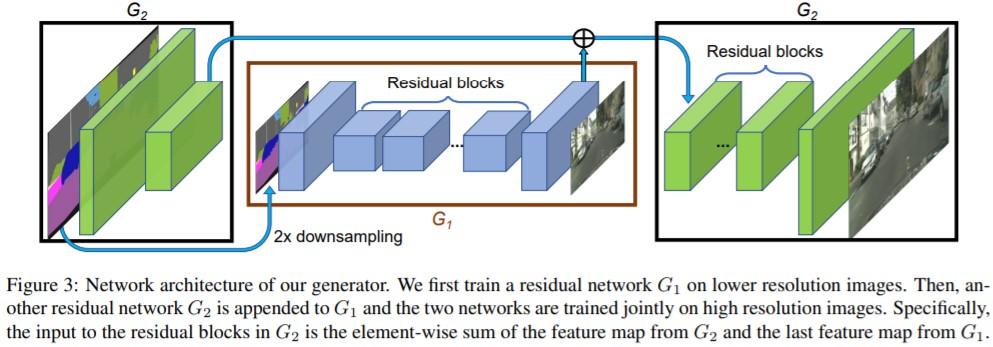

第一，设计两个生成器，小生成器G1建模global降采样的小图像，相关特征输入大生成器G2建模大图像。有点像UNet的思路。

第二，D在多尺度上衡量loss。G loss中除了perceptual和PatchGAN loss，还用feature matching loss替换了L2/L1 loss。即，输入鉴别器，计算特征的相似性。之所以不监督L1/L2，是不希望保真和平滑。

第三，用instance map而不是label，防止多个同类instance相邻导致map糊成一片。同时，instance map作为condition，可以使网络具有随机性，甚至可以编辑生成图像。

## :fire: Semantic Image Synthesis with Spatially-Adaptive Normalization

SPADE：同时控制style和semantic。CVPR 2019

- 图像生成
- GANs

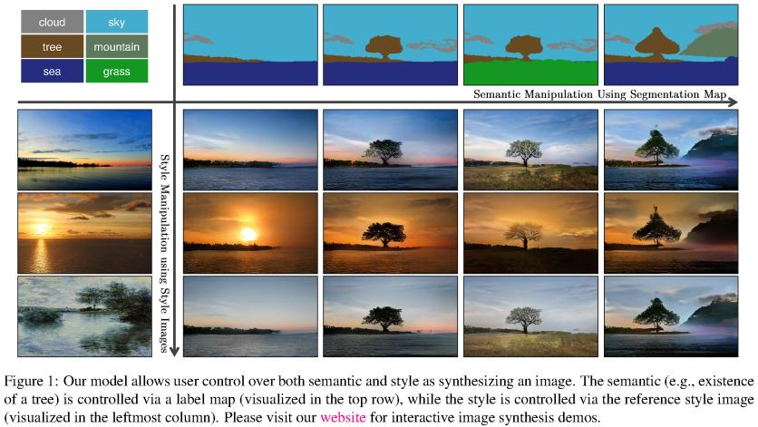

作者称该方法为spatially-adaptive normalization。当提供图像语义信息时，可产生如图结果。

整体网络：

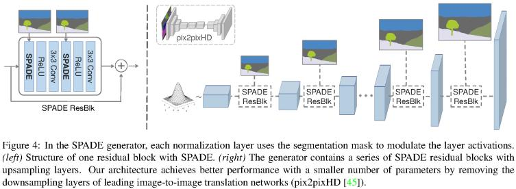

语义分割map会持续输入decoder。偶尔需要downsample以正常输入。

具体而言，SPADE就是一个对normalize后的feature map的仿射变换：

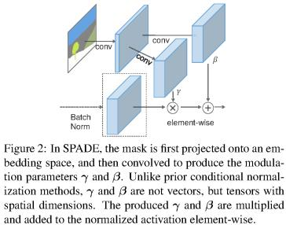

注意，SPADE的输入是分割图，即map是该所谓conditional GAN的输入条件。而一般的BN之类都属于无条件归一化。

起名为denormalize，实际上就是仿射变换。

为什么传统的条件输入方法无效？假设现在只有单类别，经过normalize和卷积后，就失去了所有信息（又变成0均值），因此输出是平凡的。参见第3页。

作者认为，encoder处理的是style，而SPADE处理的是semantic。因此，我们给图4加入encoder，输入为具有目标style的图片，那么输出图像就同时具有semantic和目标style。这就是为什么如图1可以在两个维度变换。

loss和pix2pixHD一样，除了将L2改为hinge loss。实验发现每一项loss都很重要，少一个都不行。监督器用的也是pix2pixHD中的multi-scale discriminator。

## Reconstructing the Noise Manifold for Image Denoising

迫使GAN学习和鉴别噪声流形。ECCV 2020

- 图像去噪
- GANs

图像本身是高维的，但噪声是低维的。建模噪声（残差）比建模自然图像更简单。因此要用GAN学习噪声流形。

其实大家几乎都在用短连接结构，包括GAN也是。本文特别的是：让鉴别器也在残差上操作。同时，学习的噪声包括各种手机、相机、传感器产生的噪声，从而实现盲去噪。

本文指标是PSNR和SSIM。我比较怀疑该工作的训练过程。

有个问题：噪声和图像本身可能是耦合的。作者强调这种方法对object-independent友好。

## LIP: Local Importance-based Pooling

LIP：加权池化，权重是可学习的。ICCV 2019

- 自注意力

我们常用空域降采样，来扩大感受野、降低计算量。常见的有平均池化、最大池化和跨步卷积。

但这些降采样都是盲目的，会丢失信息。因此本文提出加权池化，权重是可学习的。

实现方式很简单：

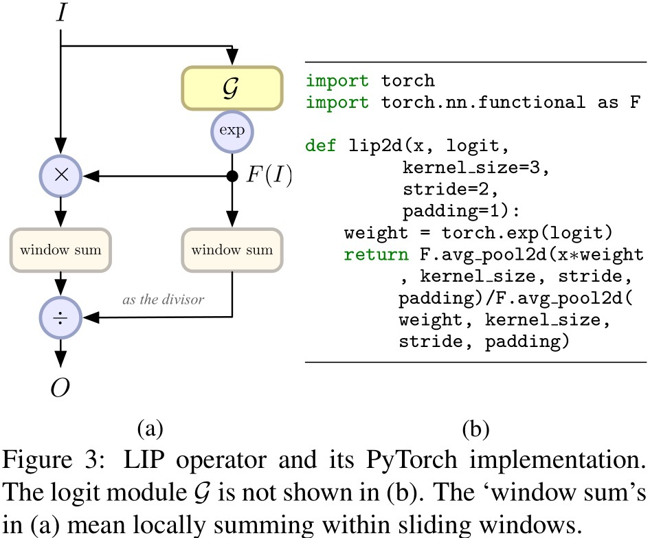

其中的logit可以通过各种可学习的网络G习得，然后注意用`exp`处理，使之非负且易于优化。本文使用的是FCN。

注意，由于是池化，因此将stride设为2，padding设为1，就可以将边长降为1/2了。

## :fire: GANs Trained by a Two Time-Scale Update Rule Converge to a Local Nash Equilibrium

TTUR：一个简单的GANs稳定收敛方法。本文还引入了Fréchet Inception Distance（FID），一种比inception更好的GANs评估方法。NIPS 2017

- GANs

让discriminator和generator分别收敛。利用stochastic approximation理论，可以证明TTUR能使GANs在弱条件下收敛到stationary local Nash equilibrium。

由于GANs是二者的博弈，因此最终的结果是一种纳什均衡。而梯度下降法显然可能导致不收敛。由于梯度法本身是一种局部最优方法，因此得到的结果也只满足局部纳什均衡。具体定义：

> If there exists a local neighborhood around a point in parameter space where neither the generator nor the discriminator can unilaterally decrease their respective losses, then we call this point a local Nash equilibrium.

即如果无法自顾自地更优，而只能通过牺牲另一方的性能换取自身更优，那么经过迭代后，这种平衡会被破坏，因此就不是纳什均衡。

主要观点：discriminator应该具有更大的学习率。即使generator在变化，只要其变化率足够小，那么discriminator仍然能准确感知，从而达到均衡；反之，generator剧烈变化会使得网络不断进入新的环境，从而使得discriminator难以收敛。

## :fire: DeOldify

一个老黑白照片上色的深度学习项目，[[主页]](https://github.com/jantic/DeOldify)。2020仍在维护

- 图像增强
- 图像上色
- GANs

技术细节包括：

- 预训练U-Net作为generator。
- spectral normalization
- self-attention
- two time-scale update rules
- [[NoGAN]](https://github.com/jantic/DeOldify#what-is-nogan)
- perceptual loss + critic loss

其中，NoGAN非常重要。作者认为，GAN的训练不重要，其组成成分的分开的、有针对性的预训练才是最重要的。这些预训练能够解决GAN的诸多问题。

作者称DeOldify是第一个采用类似策略的。但我在ESRGAN上也见到了。

一般的progressive GAN需要花好几天的时间才能保证训练的稳定收敛。而这种预训练能更好地解决问题，且真正的GAN训练只需要花一点点时间。

而TTUR会强调鉴别器的训练，因此和NoGAN非常搭。

## :fire: ProxylessNAS: Direct Neural Architecture Search on Target Task and Hardware

ProxylessNAS：第一个考虑硬件latency的NAS；不会因为候选集增大而显存溢出。ICLR 2019

- NAS

> 20-12-14

**问题**：NAS在性能和资源消耗上难以共同优化。对于可差分NAS，它们连续化表征网络结构，问题是显卡消耗随着网络子集扩增线性增加。对于使用proxy任务的NAS（例如只训练几个block），精度不佳。

**目标**：解决可差分NAS的显存消耗问题，直接学习结构，无需使用proxy tasks。优化目标不仅有target task性能，还有在hardware上的延迟等。

**解决1**：首先设置一个over-parameterized的超大网络，然后将NAS视为path-level pruning的过程。每一条path都有一个可学习参数，来决定其重要性。这样，训练过程中不需要任何meta-controller。

**解决2**：仅考虑解决1，随着路径集越来越大，显存会爆炸。为解决该问题，在训练时，仅当前考虑路径会被激活，其他路径都被冻结。

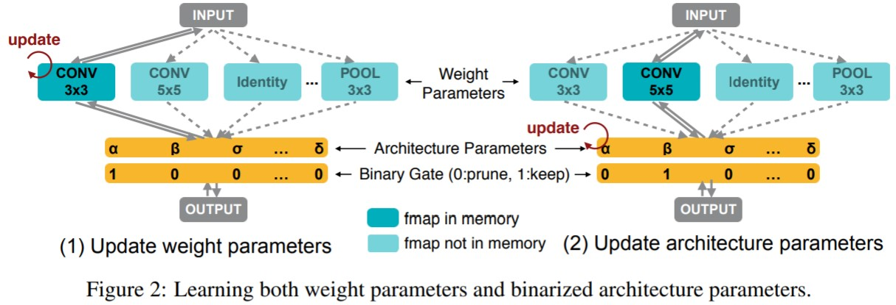

具体而言，训练是两步交替迭代的。

- 先固定重要性指标（architecture parameter），迭代网络参数。此时（当前batch的）binary gate是随机生成的（概率即根据归一化的重要性指标），即不知道哪条路径会被训练（其他路径会被冻结）。
- 再更新重要性指标。此时网络参数冻结。而重要性指标实际上并不在计算图里，是无法直接根据loss迭代的。以下细讲。
- 重复以上过程。

为了实现第二步，作者借鉴了BinaryConnect的方法。

简单来说，就是将loss关于概率p的梯度，转换成了loss关于g的梯度。然而注意，这一项与N项输出都有关，因此需要存储N项的输出，显存需求仍然很高。

为了解决这一问题，作者思考：如果某一个路径是最优的，那么该路径与其他路径两两比较也会是最优的。具体而言，作者每一次随机采样两条路径，计算式4。

**解决3**：进一步考虑hardware的latency。由于该指标难以差分，因此作者将其连续化，并将其作为regularization loss进行优化。此外，作者还提供了一种强化学习方法来处理hardware指标。

作者设计了一个latency预测网络。最终的latency就是每条路径的latency预测的加权平均。实际上，latency loss只与重要性指标相关：因为涉及到权重。latency loss不会影响网络参数。

我的大致理解：例如文中提供了7种可选模块。首先，我们要训练latency预测器，输入是网络的一些关键参数，例如卷积核尺寸、输入尺寸、输出尺寸，输出gt就是该模块在某硬件上的latency。收敛以后就冻结。由于latency loss就定义为预测器输出乘以重要性指标，因此latency loss关于重要性指标的梯度就是预测器输出，物理意义就是latency。因此，latency越大，loss理论上越大（若预测网络训练得足够准确）。

最终，latency loss要乘一个tradeoff系数$\lambda$，和性能loss相加。

## :fire: Once-for-All: Train One Network and Specialize it for Efficient Deployment

OFA：只需要训练一个大网络，不同tradeoff属性的小网络可以从中获取。ICLR 2020

- 网络剪裁
- 网络加速
- NAS

**目标**：NAS是边训练边搜索，而且只能得到一个网络。本文提出的OFA，只需要训练一次。当训练完成后，我们直接从中获取子网络，作为所需网络，而无需再训练。最终，作者可以获得超过1e+19个子网络，每一个子网络的tradeoff都不尽相同。换句话说，作者分离了training和search。search阶段无需training。

**训练难题**：训练目标是同时提高所有子网络的精度。然而子网络太多，全部考虑在计算上太复杂。而随机采样子网络，则会导致精度下降。本质难题在于：所有子网络是耦合的，牵一发而动全身。

**训练方法**：

- 网络是一个常用的块堆叠结构，分辨率不断降低，而通道数不断增加。降分辨率通过步长为2的卷积实现。
- 例如，这是一个5个块的网络，每个块的层数可选2、3、4，每一层的宽度成长率和卷积核尺寸都有3种选择，那么大概就有$\left(9^2+9^3+9^4\right)^5 \approx 2e{+19}$个可选子网络。
- 渐进收缩（progressive shrinking）。先训练大网络，再fine-tune小网络。如图3，首先在输入分辨率上可任选（elastic），然后依次变化kernel size、depth和width。每一次变动，本质上是扩大采样池，让更多子网络参与训练。
- 注意，大网络和小网络的权值是包含关系，不是独立的。如图5，对于卷积核尺寸，7x7卷积核挖掉边缘，经过变换后就得到了5x5卷积核；对于深度，3层网络就是4层网络的前3层。如图6，首先计算每一个通道的L1范数，根据从大到小排列，然后3通道就是4通道的前3大通道。
- 由于子网络仅仅是在预训练好的大网络上fine-tune，因此网络之间的扰动会比较小。如果从小到大训练，显然权值会很不准确且变化剧烈。
- 训练仅考虑精度。

**搜索方法**：

- 选择16K个子网络，在10K验证集图片上测定精度和延迟，分别训练一个精度和延迟预测器。
- 具体搜索方法为evolutionary search。
- 根据附录A，精度预测器是一个3层FC，中间层有400个隐藏单元。网络的每一层的卷积核尺寸和宽度成长率被编码为one-hot向量，然后输入FC。效果还行吧，预测精度和实际精度的RMSE最好在0.21%，最差在15%以上。
- 延迟预测器参见ProxylessNAS。

全文偏工程，但井井有条，而且实验充分让人信服。

## Image Quality Assessment for Perceptual Image Restoration: A New Dataset, Benchmark and Metric

PIPAL：评估用于IR的FR-IQA方法，特别是评估在GAN IR任务上的表现，并尝试改进。ECCV 2020

- 图像质量评估
- 建库

**问题1**：作者发现，现有的IQA方法，如PSNR、PI等指标，其结果与图像主观质量不完全一致。特别是无法公平地评估GAN IR方法，原因是无法分辨GAN生成的纹理以及真实的细节。

**解决1**：首次建立了一个关于GAN的image restoration图像的库，称为Perceptual Image Processing ALgorithms（PIPAL）。库中包含1.13 million个主观评价结果，基于可靠的Elo system。

**建库方法**：选择纹理丰富的patch，用40种失真予以降质。失真类型见表10，其中一些是降质程度较轻的通用降质方法；其余是相关IR方法中，先降质，然后SR或去噪。增强通常会产生新的噪声，例如GAN的噪声，因此先降质后增强也算一种失真类型。

**Elo system**：一种可拓展、可靠的基于概率的打分机制。作为对比：五分制容易引入bias；两两比较打分的工作量非常大，而且无法输出MOS分。具体参见论文第六页。

**发现**：LPIPS等指标比PSNR和PI指标更适用于评估IR方法，特别是GAN方法。

**实验结果**：

- 相关性最高的指标PieAPP，也仅达到0.7左右。当然这是在PIPAL库上的结果。
- 不同指标在不同失真上表现不同。但评价GAN SR结果时，CC不约而同都很低，几乎不高于0.5；并且PSNR结果特别低（要注意是失真较轻微的情况下）。
- LPIPS、PieAPP和DISTS表现较好。NIQE和PI表现次之。
- ESRGAN在MOS和LPIPS上表现最出色，但在PSNR、SSIM、PI、Ma和NIQE上表现糟糕。

**问题2**：现有IQA方法对空域的misalignment容错率低。但实验不严谨，大部分是说理。有一定道理，例如人对misalignment不敏感（只要shape不变，位置变化难以察觉），但FR-IQA方法对此敏感。

**解决2**：先用L2池化代替原本的池化层；然后，提出不仅仅是点对点评估，而是点对邻域评估。具体略，参见论文。

## :fire: G-VAE: A Continuously Variable Rate Deep Image Compression Framework

Gained VAE：学习JPEG的量化系数table，通过学习一对量化权值矩阵，实现单网络-多率失真性能。

在encoder末端和decoder前端加一对gain units，貌似是一对权值矩阵。每一个权值列向量代表对通道的线性组合权重，是在某特定lambda下训练得到的。
因此，不同lambda对应不同列向量，因此该矩阵涵盖了大部分率失真情况。
通过对两个列向量插值，可以实现率失真性能的连续过渡。

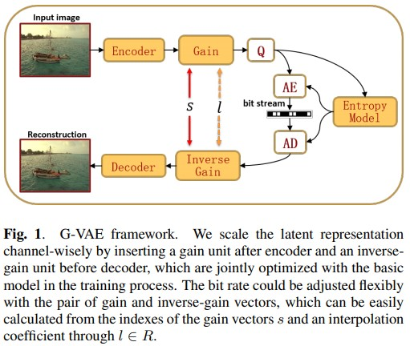

- 图像压缩
- 率失真控制
- JPEG

我们希望只训练一个压缩网络，具有多种率失真性能。然而，现有方法都会降低性能。why？

本文加入了一对gain和inverse gain unit。
unit的kernel element是一个gain matrix，包含几个gain vectors。
每个gain vector对应一个率失真设置（例如训练时的lambda）。
联合优化。
通过对两个vector插值，可以连续变化率失真性能。

类似JPEG，为了实现不同的压缩比，JPEG内置了一个table，在不同压缩比下对权重进行不同的加权。
同理，本文也提供了这样的table。不同的是：1，本文的matrix可学习；2，本文的matrix实际上是一组权值向量；实验中设为6组，即在6中lambda下训练得到（训练时随机抽取一列）。

## CVEGAN: A Perceptually-inspired GAN for Compressed Video Enhancement

**目标**：增强压缩视频的主观质量

**基本方法**：GAN

**贡献点**：残差，注意力，训练方式等；比较杂且浅。

**实验**：只和作者自己的SR算法，以及RNAN比；忽略了其他绝大多数增强算法，包括intro中提到的MW-GAN。
