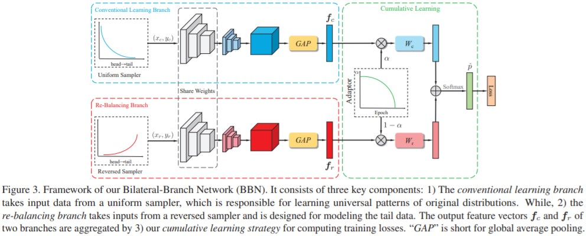

# PAPER DAILY

- [PAPER DAILY](#paper-daily)
  - [Learning Enriched Features for Real Image Restoration and Enhancement](#learning-enriched-features-for-real-image-restoration-and-enhancement)
  - [BBN: Bilateral-Branch Network with Cumulative Learning for Long-Tailed Visual Recognition](#bbn-bilateral-branch-network-with-cumulative-learning-for-long-tailed-visual-recognition)
  - [SRFlow: Learning the Super-Resolution Space with Normalizing Flow](#srflow-learning-the-super-resolution-space-with-normalizing-flow)
  - [Multi-level Wavelet-based Generative Adversarial Network for Perceptual Quality Enhancement of Compressed Video](#multi-level-wavelet-based-generative-adversarial-network-for-perceptual-quality-enhancement-of-compressed-video)
  - [Photo-Realistic Single Image Super-Resolution Using a Generative Adversarial Network](#photo-realistic-single-image-super-resolution-using-a-generative-adversarial-network)
  - [ESRGAN: Enhanced Super-Resolution Generative Adversarial Networks](#esrgan-enhanced-super-resolution-generative-adversarial-networks)
  - [Pixel-Adaptive Convolutional Neural Networks](#pixel-adaptive-convolutional-neural-networks)
  - [Drop an Octave: Reducing Spatial Redundancy in Convolutional Neural Networks with Octave Convolution](#drop-an-octave-reducing-spatial-redundancy-in-convolutional-neural-networks-with-octave-convolution)
  - [Enhanced Image Decoding via Edge-Preserving Generative Adversarial Networks](#enhanced-image-decoding-via-edge-preserving-generative-adversarial-networks)
  - [HiFaceGAN: F ace Renovation via Collaborative Suppression and Replenishment](#hifacegan-f-ace-renovation-via-collaborative-suppression-and-replenishment)

## Learning Enriched Features for Real Image Restoration and Enhancement

MIRNet，ECCV 2020：注意力、多尺度的集大成网络。开源完善。声称是图像恢复的SOTA。

- [tag] 图像恢复
- [tag] 注意力

> 20-10-15

前人工作大多处理全分辨图像，或处理渐进的低分辨率表示。作者认为前者空域建模准确但语义建模不健壮，后者反之。本文希望在网络中保持高分辨率表示，同时从低分辨率表示中获取较好的语义信息。

大致集成了以下模块：多尺度卷积及其信息交互，空域和通道域注意力建模，基于注意力的多尺度特征融合。

经过如此繁杂的处理，作者认为提取的特征是enriched的。在多个image benchmark上达到了SOTA。

网络整体如图1所示，是一个块堆叠结构。每个块内部有两个多尺度残差块，多尺度残差块内部类似RANet结构，即降分辨率得到低分辨率表示，然后与高分辨率表示之间有交互。

交互具有选择性，如图2所示，本质就是基于注意力融合。

空域和通道域注意力见图3。一般操作。

总的来说就是集大成，设计没啥特别的，但效果好（我怀疑速度很慢）。

## BBN: Bilateral-Branch Network with Cumulative Learning for Long-Tailed Visual Recognition

BBN，CVPR 2020：分开训练特征提取和分类器。长尾分类当年SOTA。

- [tag] 图像分类
- [tag] 长尾分布

> 20-10-17

首先作者揭示，广泛用于长尾分布的重采样技术，虽然会增强分类器的学习，但在一定程度上会损害特征学习。

之后是一个有趣的实验。作者先用三种方式训练网络，然后冻结主干网络（所谓的特征提取部分），从零重训分类器，得到如图2结果。本文的motivation就出来了。

本文就希望同时兼顾二者的训练。

如图3，作者搭建了一个双路网络，称为BBN。在上路，数据是均匀采样的；在下路，数据是重均衡采样的。双路输出的特征通过加权组合，等价于双路的loss加权组合得到最终的loss。作者也将这种策略归为课程学习。

权重$\alpha$是变化的：在初始阶段更重视上路，在后期更重视下路。

具体而言，$\alpha = 1 - \left(\frac{T}{T_{max}}\right)^2$，$T$是epoch数。随着epoch增加，$\alpha$会加速减小。即给初始阶段提供了足够的时间。补充材料图7也说明了这一点，但貌似没有实验。

注意特征提取模块的参数是共享的。

## SRFlow: Learning the Super-Resolution Space with Normalizing Flow

SRFlow，ECCV 2020：基于Flow的生成方法。训练稳定，单一损失，变换结果简单，可逆。

- [tag] 图像超分辨
- [tag] Flow

> 20-10-17

SR问题是一个经典的病态问题，有很多可能的解。这一事实很重要，但被现有方法忽略了：现有方法是限定的（deterministic），基于重建loss和对抗loss的组合学习。

本文提出用归一化的flow完成SR，损失函数仅使用负对数似然。该方案更贴近病态问题的本质，也能够生成多样的输出。

最关键的还是灵活改变输出。

作者称，SRFlow的PSNR和perceptual quality metrics都超过了GAN方法，太强了。

具体而言，本文设计了一个conditional normalizing flow结构。所谓conditional，就是提供LR条件下，预测潜在的HR的条件分布。

从第三章开始的方法没有细看了。

## Multi-level Wavelet-based Generative Adversarial Network for Perceptual Quality Enhancement of Compressed Video

MW-GAN，ECCV 2020：在小波域增强主观质量。

- [tag] 压缩视频增强
- [tag] GANs
- [tag] 小波域

> 20-10-17

Motivation（图2）：主观质量与高频分量高度相关。现有增强方法大多都无法提升甚至恶化主观质量。说明方法：观察小波变换后的高频分量的能量大小。

网络设计（图3）：典型的GAN设计，只不过处理对象和训练标签都是图像的小波谱。

loss由小波域重建loss、运动补偿loss和对抗loss组成。对抗loss是随着epoch增大逐渐参与进来的，运动补偿loss是逐渐退出的，小波域重建loss在不同子带上有不同权重。

小提示（和作者交流）：
- 虽然故事说主观与高频很相关，但权重是一样的，并非重点收敛高频子带或放弃低频子带。
- 在小波域和像素域监督其实没啥区别。在小波域监督也会导致模糊。
- 用RGB训练比在Y上训练效果更明显。
- Multi-level对抗监督的做法被广泛使用，效果不错。
- 对压缩图像而言，保真也是很重要的，因此不能像SR那样随意。

后记：
- 主观效果不明显，原因是去掉了perceptual loss。
- 考虑了LPIPS和PI指标。

## Photo-Realistic Single Image Super-Resolution Using a Generative Adversarial Network

SRGAN，CVPR 2017：第一个实现4倍升采样的细节恢复网络。

- [tag] 超分辨
- [tag] GANs

> 20-10-18

训练loss由content loss和对抗loss组成。对抗loss会迫使结果更接近自然图像。content loss要求perceptual相似性（VGG中后端特征的相似性），而非像素level的相似性。

结果显示，SRGAN的MOS得分要显著高于传统CNN的结果。

由图2，PSNR和SSIM高的图像，其主观质量并非最高的。

数据集获取：将HR图像高斯模糊，然后降采样。

训练是交替优化鉴别器D和生成器G。鉴别器的优化目标是：

很简单，就是要准确认出真实图像，并且识别出假图像。

生成器是B个结构相同的块组成的。升采样通过sub-pixel（重排）实现。

根据[44]的建议，网络没有使用最大池化，并且使用了$\alpha=0.2$的LeakyReLU。鉴别器网络是8层3x3卷积层，每一层通道数从64到512增加，隔2层翻1倍。当通道数翻倍时，图像长和宽减小1/2（因为是分类器）。

生成器的loss采用组合形式：

其中第一项是VGG loss，即经过预训练的19层VGG网络的第j次卷积后（经ReLU激活）、第i次最大池化前输出的特征图的MSE：

$\phi$就是VGG参数。

第二项对抗loss，刻画生成图像与自然图像的差距，由监督器决定差距大小：

根据[22]，为了使梯度表现更好，该式没有使用$\log{(1 - D)}$。想象一下，如果D输出趋于0，那么loss应该越大越好，因此式6更好。

作者对比了content loss用MSE，VGG22和VGG54的结果，发现VGG54的MOS分表现最好。

## ESRGAN: Enhanced Super-Resolution Generative Adversarial Networks

ESRGAN，ECCVW 2018：改进SRGAN的细节问题。

- [tag] 超分辨
- [tag] GANs

> 20-10-18

改进：
- 使用Residual-in-Residual Dense Block。
  - 取消了BN操作。
  - RRDB输出经过scaling后传输。
- 参数初始化方差尽可能小。实验证实的。
- 让鉴别器分辨两个图像哪个更真实，而不是判断是否真实。
- VGG loss改为对比激活前的特征。

最后，为了权衡PSNR和感知质量，作者尝试了网络参数插值和图像插值，结果是前者更好。

ESRGAN的整体结构和SRGAN保持一致（图3），但细节被修改。见图4。

当训练数据和测试数据存在差距时，使用BN会导致伪影[26,32]。因此去除。所谓的Residual in Residual，就是大Residual嵌套小Residual。RRDB输出经过放缩后再并入主路，增强稳定性[35,26]。

鉴别器的loss和生成器的对抗loss分别改成了以下形式：

其中RaD是指Relativistic average Discriminator：

内部期望是在mini-batch上计算的。再具体：

最后，作者将VGG loss改为未激活的对比。这是因为特征图稀疏，激活后几乎都是inactive的。

生成器的loss改为三项，即最后加上一个L1重建loss，见式3。

$$
L_G = L_{percep} + \lambda L_G^{Ra} + \eta L_1
$$

为了让PSNR和感知质量权衡，或抑制GAN导致的噪声，我们可以调整L1 loss和对抗loss的权重。但这样做很麻烦。

在训练阶段，我们先用L1 loss训练生成器。然后再用式3的组合loss训练整个GAN。

## Pixel-Adaptive Convolutional Neural Networks

PAC，CVPR 2019：给卷积核乘以可学习的、spatially varying的权值。借鉴双边滤波器思想。

- [tag] CNNs
- [tag] 注意力

> 20-10-19

看这篇论文前，可以回忆[双边滤波器](https://www.cnblogs.com/wangguchangqing/p/6416401.html)。不同于高斯滤波器（仅考虑位置关系），双边滤波器引入了$\alpha$截尾均值滤波器，考虑像素灰度值之间的差异；然后两个滤波器相乘，就得到了双边滤波器。

作者仿照双边滤波器，提出了PAC。与自注意力方法或全动态方法不同，PAC和双边滤波器一样，仅仅关注局部，因此在一定程度上减小了计算量，实现更简单。

接下来就是讲故事了。

参数共享是CNNs的优势，也是其劣势。为了解决该劣势，作者提出用spatially varying的权值乘以滤波器权值；该varying权值是根据局部像素信息学习得到的。

可以简单证明，PAC是许多滤波器的一般化，即可以特化为众多滤波器，例如双边滤波器、一般卷积和池化等。

直观上看，我们迫使CNNs卷积核共享是不合理的。为了减小loss，CNNs不得不用有限的卷积核来卷积不同内容的特征图。

再进一步，当CNNs训练好以后，卷积核参数就不可变了。本文方法引入了可学习的倍乘参数，因此对于不同的输入图像，可以产生不同的倍乘参数，改变卷积核权值。

现有的卷积核大致可以分为两种：一种是预定义的，例如双边滤波器；另一种是全动态的，很难扩展到整个网络，因为计算复杂度太大了。PAC在二者之间，往下看。

传统卷积是这样的：

i是卷积中心点。可见，卷积核W取值仅仅取决于相对位置差$p_i - p_j$，与内容无关。

为了让卷积核W取值与内容有关，我们把位置进行编码，再对编码信息卷积，即：

但这样做（把特征映射到更高维空间），会导致卷积计算量庞大，卷积向量过于稀疏。

为了解决这一问题，作者采取了另一种方式：作者没有将特征往更高维空间映射后卷积，而是引入spatially varying的核K，让核对高维特征进行简单处理。

例如K可以取高斯核。此时，f就被称为adaptive feature，而K被称为adaptive kernel。f可以自定义，例如将位置信息和色彩信息编码：$f = (x, y, r, g, b)$，也可以是学出来的。

该方法可以特化为见过的卷积核。

- 当W为高斯滤波器时，双边滤波器就出现了。
- 当K恒等于1时，就是一般卷积；即不包含特殊的位置编码信息。
- 当K恒等于1，W恒等于1/(s^2)时，就是平均池化。

## Drop an Octave: Reducing Spatial Redundancy in Convolutional Neural Networks with Octave Convolution

OctConv，ICCV 2019：低频卷积的特征图（表示）是可压缩的，进而减小内存需求和计算量。

- [tag] CNNs
- [tag] 模型加速
- [tag] 频域

> 20-10-21

在缩小低频通道尺寸的同时，设计了其与完整通道的交互方法。

设置一个超参数$0<\alpha<1$，使得$\alpha \%$通道的分辨率是减半的，剩余通道的分辨率不变。这样，计算量和内存需求都降低了。

如何得到这样的特征图呢？在OctConv的输入端，对于划分为低分辨率通道的通道输入，会被高斯模糊后采样，分辨率就变为1/2x1/2了。然后才是OctConv，交互方法也很直观，见图：

实验中对通道进行傅里叶变换，发现低频通道确实几乎只有低频，而完整通道高低频兼具。

作者称还能提高准确率。这一点或许和感受野扩大有关：缩小的通道上做卷积，相当于空洞卷积。

## Enhanced Image Decoding via Edge-Preserving Generative Adversarial Networks

EP-GAN，ICME 2018：用GAN增强解码视频质量。

- [tag] GANs
- [tag] 压缩视频增强

> 20-10-30

在一般GAN的基础上加入一个图像边缘预测网络。用Sobel算子生成边缘map，在loss中惩罚生成边缘map与预测map的L2 loss。

预测map会和特征fuse，然后进一步处理。

仅考虑了JPEG；指标为PSNR-B，PSNR和SSIM。

## HiFaceGAN: F ace Renovation via Collaborative Suppression and Replenishment

HiFaceGAN, ACM 2020：

- [tag] GANs
- [tag] 人脸增强

> 20-10-30
