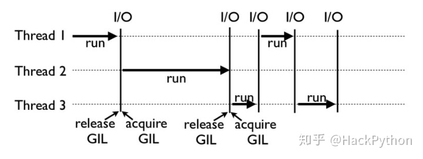

# PYTHON

- [PYTHON](#python)
  - [字符串](#字符串)
  - [文本文件](#文本文件)
  - [CSV 文件](#csv-文件)
  - [PANDAS 数据](#pandas-数据)
  - [绘图](#绘图)
  - [命令行参数](#命令行参数)
  - [断言](#断言)
  - [多进程](#多进程)
  - [随机数](#随机数)
  - [NUMPY 数组](#numpy-数组)
  - [路径](#路径)
  - [时间](#时间)
  - [进度条](#进度条)

## 字符串

- **子字符串查找**：`str.find(sub,start,end)`；返回第一个子字符串的初始索引；若没找到，返回 `-1`。

<details>
<summary><b>多行字符串</b></summary>
<p>

```python
print("""Hello!
Welcome!
Goodbye!"""
)
```

```bash
Hello!
Welcome!
Goodbye!
```

尽量不要缩进，否则输出也有缩进。

</p>
</details>

<details>
<summary><b>字符串 format 简单方法</b></summary>
<p>

应该是 3.8 的新特性。

```python
name = 'Ryan'
print(f'My name is {name}.')
```

```bash
My name is Ryan.
```

</p>
</details>

<details>
<summary><b>字符串拼接</b></summary>
<p>

```python
a = 'Hello ' + 'World!'
print(a)

b = (
    'Hello '
    'World!'
    )
print(b)
```

```bash
Hello World!
Hello World!
```

注意，第二种写法没有逗号，否则就变成 tuple 了。

</p>
</details>

## 文本文件

<details>
<summary><b>读写</b></summary>
<p>

```python
fp = open("xxx.txt", 'w')
fp.write("haha\nhaha")
fp.close()
```

逐行读：

```python
while True:
    line = fp.readline()
    if not line:
        break
```

NUMPY 提供了更快的二进制读写方式：`np.fromfile(fp, dtype=np.uint8, count=block_size)`。

</p>
</details>

## CSV 文件

<details>
<summary><b>读写</b></summary>
<p>

采用一般文本文件的读取方法：

```python
import csv

csv_path = 'demo.csv'

# read
csv_fp = open(csv_path, 'r', newline='')
reader = csv.reader(csv_fp)
for line_list in reader:
    print(line_list)

# write
csv_fp = open(csv_path, 'w', newline='')
writer = csv.writer(csv_fp)
writer.writerow(['index_vid','psnr_ori','psnr_enh','dpsnr','name_vid'])

csv_fp.close()
```

使用 PANDAS 更智能。

```python
import pandas as pd

df = pd.read_csv(csv_file)
saved_column = df.column_name  # you can also use df['column_name']
```

</p>
</details>

## PANDAS 数据

<details>
<summary><b>DataFrame</b></summary>
<p>

每一列都是数据，对应一个标签。用字典表示：

```python
d = {'col1': [1, 2], 'col2': [3, 4]}
df = pd.DataFrame(data=d)
```

</p>
</details>

## 绘图

MATLAB 很强大，但我更倾向于开源的 PYTHON。

单就 2D 绘图而言，MATPLOTLIB 可以胜任；但如果要绘制大量数据或 3D 图，推荐 MATLAB 或其他 PYTHON 库。

PYTHON 的绘图能力仰赖众多开源项目。

- **3D plot**：参见[博客](https://blog.csdn.net/u014636245/article/details/82799573)。

<details>
<summary><b>2D绘图：MATPLOTLIB</b></summary>
<p>

```python
import matplotlib.pyplot as plt

plt.plot(result)

plt.title(f'dMSE, QP={qp}')
plt.xlabel('TV')
plt.ylabel('dMSE')

plt.show()

plt.savefig('demo.png')

plt.clf()  # 如果要画新图，需要清除当前内容，但保留窗口
```

参考[官方教程](https://matplotlib.org/tutorials/introductory/pyplot.html)。

</p>
</details>

<details>
<summary><b>2D 统计数据可视化：SEABORN</b></summary>
<p>

SEABORN 擅长将 2D 统计数据可视化。由于其抽象性，使得作者可以更关注数据本身，而不是代码细节。

SEABORN 的基础是 MATPLOTLIB，常用数据格式为 PANDAS。

参见：

- [概览](https://seaborn.pydata.org/index.html)
- [所有教程](https://seaborn.pydata.org/tutorial.html)
- [可接受的数据结构](https://seaborn.pydata.org/tutorial/data_structure.html)

```python
d = {'iter': val_logs['iter'], 'PSNR': val_logs['PSNR']}
df = pd.DataFrame(data=d)

sns_fig = sns.relplot(data=df, x='iter', y='PSNR')  # 绘制关系图

sns_fig.savefig('output.png')  # 保存图像
```

</p>
</details>

<details>
<summary><b>堆积柱状图</b></summary>
<p>

每次 `bar` 都建立在底层 bar 之上。

```python
plt.bar(index_lst, new_y_lst, width=3, bottom=old_y_acc_lst)
```

默认 hold，直至 `plt.show()`。

</p>
</details>

## 命令行参数

<details>
<summary><b>ARGPARSE</b></summary>
<p>

> 常规用法

- 设置长 + 短命名，注意引用时为长命名。
- 设置默认值，使用时可缺省，方便。
- 写一段话，描述参数的含义，方便理解。

```python
import argparse

parser = argparse.ArgumentParser()
parser.add_argument('-io_v', '--io_val', type=str, \
    default="disk", \
    help="IO backend for validation: (lmdb | disk*)."
    )

opts = parser.parse_args()
print(opts.io_val)

opts_dict = vars(opts)  # 转换成字典，方便 log 逐行打印
log_fp.write(opts_dict['io_val'] + '\n')
```

也可以输入列表：

```python
parser = argparse.ArgumentParser()
parser.add_argument('gpu', metavar='N', type=int, nargs='+')
args = parser.parse_args()
print(args.gpu)

python test.py 0 1 2 3
```

有时可以对参数分组（例如训练集和测试集都有相同含义的参数）：

```python
group1 = parser.add_argument_group("group 1")
group2 = parser.add_argument_group("group 2")

group1.add_argument("--option1")
group2.add_argument("--option2")
```

</p>
</details>

## 断言

<details>
<summary><b>ASSERT</b></summary>
<p>

```python
assert not op.exists(a_path), "ALREADY EXISTS!"

a = "haha"
b = "hahha"
assert a in b, (f"{a} is not in "
    f"{b}!")
```

</p>
</details>

## 多进程

<details>
<summary><b>MULTIPROCESSING</b></summary>
<p>

pool of workers：

- `apply_async`：支持异步，非阻塞，返回结果后回调。
- `map`：阻塞，直至结果返回。
- `close`：关闭进程池，不再接受新任务。
- `join`：主进程阻塞，等待子进程退出。要在 `close` 后使用。

```python
import multiprocessing as mp
import time


def func_demo(proc_id):
    print(f"start {proc_id}")
    time.sleep(3)
    print(f"end {proc_id}")


if __name__ == '__main__':  # WINDOWS 下要写在里面
    pool = mp.Pool(processes=2)  # 最多 2 个进程并行
    proc_id_list = list(range(4)) # 0 -> 3
    for proc_id in proc_id_list:
        pool.apply_async(func=func_demo, args=(proc_id, ))
    pool.close()  # 禁止新进程加入
    pool.join()  # 阻塞，等所有子进程结束（再完成后面代码）
```

```bash
start 0
start 1
end 0
end 1
start 2
start 3
end 2
end 3
```

可以看到，同时只有 2 个进程并行。即当 0 和 1 执行后，循环阻塞，直至 0 结束后，2 或 3 才开始执行。

曾经在 `pool.apply_asygn(func)` 外面写 `pbar.update()`。后果是，pbar 速度飞快，然而 `func()` 却没有执行完。通过查看 htop 可知，`apply_sygn(func)` 是创建了众多进程，并且不受外部代码影响（不堵塞），直到 `pool.close()`。因此，`pbar.update()` 应放到 `callback()` 内部。否则进度是虚假的。

```python
...
callback=lambda x :pbar.update(1)
```

注意得有一个形参 x 。因为 `callback` 必须接收参数，哪怕是无用的。能放到 `func()` 里吗？貌似可以，但冲突很严重，速度慢。

以下介绍背景知识和原理。

进程 vs. 线程，参考[知乎](https://zhuanlan.zhihu.com/p/76343641)。

当我们启动程序时，系统中至少启动了一个对应进程。而一个进程可以包含多个线程。
这些线程可以共享进程空间中的内存空间。如果不加以管理，程序容易发生逻辑错误。
因此常用锁或信号量等机制来限制公共资源的使用。

作者开启了 PYTHON 中的多线程，发现单线程和多线程在速度上几乎没有区别。
原因：在 PYTHON 中，同一时刻只有一个线程运行，约束方式即 GIL 锁。
因此，PYTHON 的多线程不是并行，而是并发。



如图，PYTHON 在工作一段时间（check interval）后，会主动释放 GIL，让其他线程也参与工作。
在 PYTHON 中，该间隔为 15 ms。

为了sidestep GIL 问题，我们可以使用多进程而不是多线程。
由于不同进程是在不同 GPU 上执行的，因此可实现真正的并行。

回调函数，参考[知乎](https://www.zhihu.com/question/19801131)。

回调函数（callback）：当 func 结束时，会调用回调函数；回调函数的参数即 func 的返回值。
显然，为了实现回调，我们需要将 callback 函数传递给 func。
回调函数使得功能剥离，更灵活。

</p>
</details>

## 随机数

<details>
<summary><b>NUMPY</b></summary>
<p>

```python
np.random.choice(a_list)
```

从列表或迭代器中随机选一个。

</p>
</details>

## NUMPY 数组

- **reshape vs. resize**：`resize` 没有返回值，`reshape` 有。

## 路径

- **路径重命名**：`a_path.rename('/foo')`；字符串或 Path 对象都可以。
- **获取当前路径**：`print(os.getcwd())`；是启动 Python 的路径，不是程序路径。

<details>
<summary><b>Path对象</b></summary>
<p>

```python
from pathlib import Path
file_path = Path('C:/Files/file.csv')
```

`str(file_path)` 即可转变回正常字符串，可以执行 `split` 等字符串操作。

</p>
</details>

<details>
<summary><b>判断路径是否存在</b></summary>
<p>

```python
if not os.path.exists(<dir_path>):
    pass

from pathlib import Path
file_path = Path('C:/Files/file.csv')
file_path.exists()  # True
```

</p>
</details>

<details>
<summary><b>创建路径</b></summary>
<p>

```python
if not os.exists(<dir_path>):
    os.makedirs(<dir_path>)

a_Path_object.mkdir(parents=True)  # 可以代替 makedirs 的功能
```

</p>
</details>

<details>
<summary><b>合成路径</b></summary>
<p>

```python
import os.path as op
os.path.join("/home", "usrname")

from pathlib import Path
root_path = Path('C:/Files')  # 你没看错，无论系统，都用正斜杠即可！
file_path = root_path / 'file.csv'  # 比 os 简单
```

</p>
</details>

<details>
<summary><b>分解路径</b></summary>
<p>

例如提取最高层文件夹名：

```python
os.path.basename("/home/usrname/xxx.yuv").split(".")[0]

from pathlib import Path
file_path = Path('C:/Files/file.csv')
file_path.stem  # file
file_path.name  # file.csv
file_path.suffix  # csv

a_path = Path('/aa/bb/cc')
a_path.name # 'cc'
```

</p>
</details>

<details>
<summary><b>删除路径</b></summary>
<p>

只能删空路径：

```python
os.removedirs(<dir_path>)  # 只能删除空路径

shutil.rmtree(<dir_path>)  # 递归删除文件夹及文件
```

</p>
</details>

## 时间

- **返回时间戳**：`time.time()`。

## 进度条

<details>
<summary><b>TQDM</b></summary>
<p>

```python
from tqdm import tqdm

# 基础用法
for i in tqdm(range(1e3)):
    pass

# 简化的基础用法
for i in trange(1e3):
    pass

# 手动控制更新
with tqdm(total=1e3) as pbar:
    for i in range(1e2):
        pbar.update(10)  # 每次更新，进度 + 10

# 设置文字描述
pbar = tqdm([name1, name2, name3])
for name in pbar:
    pbar.set_description("processing %s" % name)

# 进一步设置属性（如宽度和描述）
tqdm(alist, ncols=80)  # 可以避免太宽导致的换行显示
# 可以把 eta 等去掉，只保留描述，百分比和 bar
with tqdm(
    total=60*24,
    ncols=40,
    bar_format='{desc}{percentage:.1f}% |{bar}|'
    ) as pbar:
    pbar.update(accum_minute)

# 关闭对象
# 最好在每个 pbar 完成使命后关闭；否则不换行。
pbar.close()
```

</p>
</details>
